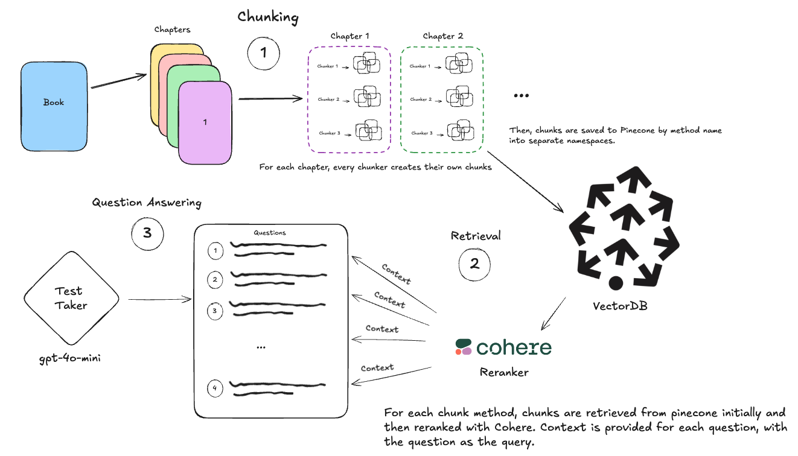

## Introduction

Like before, we setup the typical RAG pipeline for answering multiple choice questions that require context from a fictional book to answer. High quality questions were created from Claude's 3.5 sonnet model for each chapter of the book.

We did use the same novel as before, as it made it easier to manually check question and retrieval quality during early stage experimentation. The questions this time around are harder to answer without the proper context, and we found that `gpt-4o-mini` would consistently get ~30% of the questions correct. This is what we use as the baseline for the benchmark.

## Methodology

1. Chunking
   - Each chunker chunked each chapter of the book individually, these chunks were then embedded individually and stored
     in Pinecone for later use.
   - Each chunker had a different namespace to ensure that different chunks were not mixed up.
2. Retrieval (done for each question, using a combination of a vector database and reranker):
   - Query the vector database, using the question as the embedding, for the top `rerank_buffer_size` chunks for a given question.
   - Pass all `rerank_buffer_size` chunks to a reranker (Cohere or Pinecone)
   - Select the top `top_k` chunks from the reranker to be used as relevant context for the question
     - We found that reranking greatly improved the retrieval process: without reranking, we were seeing as much as 75% of questions having irrelevant context.
     - Thus, we used Cohere's reranker with the same parameters for all chunk methods in this benchmark.
3. Question Answering (Benchmark):
   - For each question: pass question, context retrieved from before, and answer choices to a language model (in this case, "gpt-4o-mini")
   - Score the language model for each question (correct or incorrect) based on whether it chose the correct answer choice out of 8 answers.
   - repeat for all questions; percent accuracy is the main metric for this benchmark.

